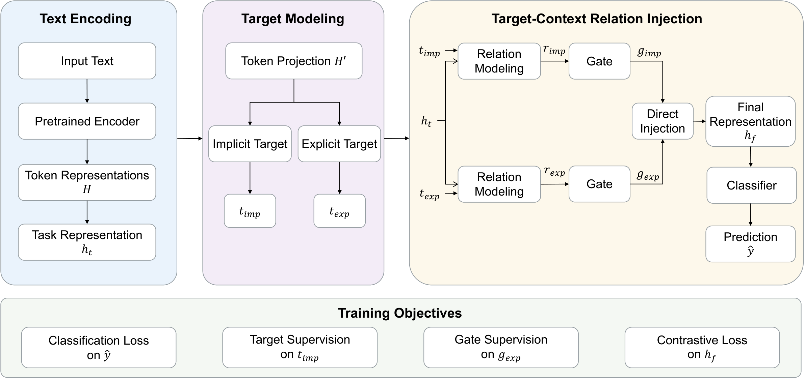

# TADI: Target-Aware Direct Injection with Dual-Path Target Modeling for Implicit Hate Speech Detection

## Overview

This repository contains the experimental code for **TADI**, a target-aware hate speech detection framework that models target information through two complementary pathways:

- an **implicit pathway** that discovers target-relevant content with attention
- an **explicit pathway** that aggregates target candidates when target positions or target terms are available

The two pathways produce target-context relation vectors, which are injected into the classification representation through gated residual connections. The code currently supports experiments on **ETHOS**, **OLID**, **IHC (Implicit Hate Corpus)**, and **ToxiCN**, using a unified coarse-grained label space (`hate` / `non-hate`).


**Framework**



## Environment Requirements

- Python `3.10+`
- PyTorch
- Transformers
- scikit-learn
- NumPy
- torch

Example environment setup:

```bash
conda create -n tadi python=3.10
conda activate tadi
pip install torch transformers scikit-learn numpy
```

Notes:

- The scripts expect Hugging Face model names or local encoder checkpoints via `--model_name_or_path`.
- For English experiments, use encoders such as `roberta-base` or `bert-base-uncased`.
- For Chinese experiments on ToxiCN, use encoders such as `hfl/chinese-roberta-wwm-ext` or `bert-base-chinese`.

## Repository Structure

```text
TADI/
├── data/                         # raw public datasets and generated unified data
├── figures/                      # README figures
├── runs/                         # training outputs and evaluation summaries
├── scripts/
│   ├── build_unified_data.py     # build merged train/val/test jsonl files
│   ├── train_tadi.py             # train + select checkpoint + evaluate on test split
│   ├── run_tadi_uniform_seed0.py # batch reproduction with a uniform setting
│   └── evaluate_tadi.py          # standalone checkpoint evaluation
└── tathate/
    ├── data/                     # dataset parsing, schema, and unified loaders
    ├── models/                   # TADI model definition
    └── training/                 # dataloaders, losses, and evaluation utilities
```

## Dataset Preparation

Raw datasets are **not included** in this repository. Please download the public datasets from their original sources and place them under `data/` with the following layout:

```text
data/
├── ethos/
│   ├── train.json
│   ├── val.json
│   └── test.json
├── olid/
│   ├── olid-training-v1.0.tsv
│   ├── testset-levela.tsv
│   ├── labels-levela.csv
│   ├── labels-levelb.csv
│   └── labels-levelc.csv
├── toxicn/
│   ├── ToxiCN_1.0.csv
│   ├── train.json
│   └── test.json
└── implicit-hate-corpus/
    ├── implicit_hate_v1_stg1.tsv
    ├── implicit_hate_v1_stg1_posts.tsv
    ├── implicit_hate_v1_stg2.tsv
    └── implicit_hate_v1_stg3.tsv
```

After placing the raw files, build the unified corpus:

```bash
python scripts/build_unified_data.py
```

This command generates:

- `data/unified/train.jsonl`
- `data/unified/val.jsonl`
- `data/unified/test.jsonl`
- `data/unified/metadata.json`
- per-dataset jsonl files under `data/unified/<dataset>/`

## Training Commands

### 1. Single-dataset reproduction

Example: RoBERTa on IHC

```bash
python scripts/train_tadi.py \
  --model_name_or_path roberta-base \
  --output_dir runs/tadi_roberta_ihc \
  --train_datasets ihc \
  --eval_datasets ihc
```

Example: Chinese RoBERTa on ToxiCN

```bash
python scripts/train_tadi.py \
  --model_name_or_path hfl/chinese-roberta-wwm-ext \
  --output_dir runs/tadi_roberta_toxicn \
  --train_datasets toxicn \
  --eval_datasets toxicn
```

`train_tadi.py` performs training, model selection, and final test evaluation in one run. The main outputs are saved to the specified run directory:

- `args.json`
- `train_history.jsonl`
- `best_model.pt`
- `last_model.pt`
- `test_metrics.json`

### 2. Uniform in-dataset reproduction

English datasets:

```bash
python scripts/run_tadi_uniform_seed0.py \
  --model_name_or_path roberta-base \
  --datasets ethos,olid,ihc \
  --runs_root runs \
  --summary_path runs/tadi_roberta_en_summary.json
```

Chinese dataset:

```bash
python scripts/run_tadi_uniform_seed0.py \
  --model_name_or_path hfl/chinese-roberta-wwm-ext \
  --datasets toxicn \
  --runs_root runs \
  --summary_path runs/tadi_roberta_zh_summary.json
```

### 3. Cross-dataset generalization

Example: train on ETHOS and evaluate on IHC

```bash
python scripts/train_tadi.py \
  --model_name_or_path roberta-base \
  --output_dir runs/tadi_roberta_ethos_to_ihc \
  --train_datasets ethos \
  --eval_datasets ihc \
  --balance_datasets
```

Example: train on IHC and evaluate on ETHOS

```bash
python scripts/train_tadi.py \
  --model_name_or_path roberta-base \
  --output_dir runs/tadi_roberta_ihc_to_ethos \
  --train_datasets ihc \
  --eval_datasets ethos \
  --balance_datasets
```

## Evaluation Commands

To re-evaluate a saved checkpoint without re-training, use `scripts/evaluate_tadi.py`. The script reads the saved `args.json`, rebuilds the dataloader configuration, loads the checkpoint, and writes a standalone evaluation report.

Evaluate the best checkpoint on the test split:

```bash
python scripts/evaluate_tadi.py \
  --run_dir runs/tadi_roberta_ihc \
  --checkpoint best_model.pt \
  --split test
```

Evaluate the best checkpoint on the validation split:

```bash
python scripts/evaluate_tadi.py \
  --run_dir runs/tadi_roberta_ihc \
  --checkpoint best_model.pt \
  --split val
```

Optionally override the evaluation dataset list when the saved label space is compatible with the target split:

```bash
python scripts/evaluate_tadi.py \
  --run_dir runs/tadi_roberta_ethos_to_ihc \
  --checkpoint best_model.pt \
  --split test \
  --eval_datasets ihc
```

By default, the script writes the results to:

- `runs/<run_name>/eval_test_best_model.json`
- or `runs/<run_name>/eval_val_best_model.json`
